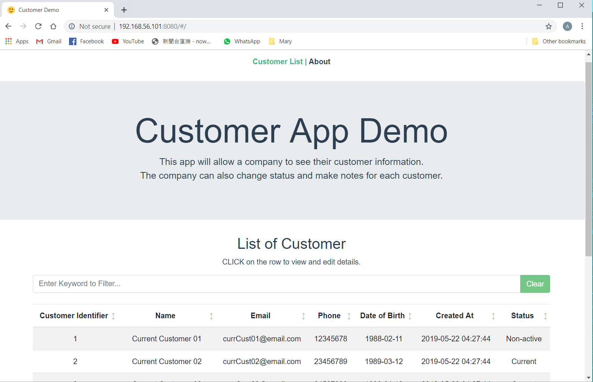
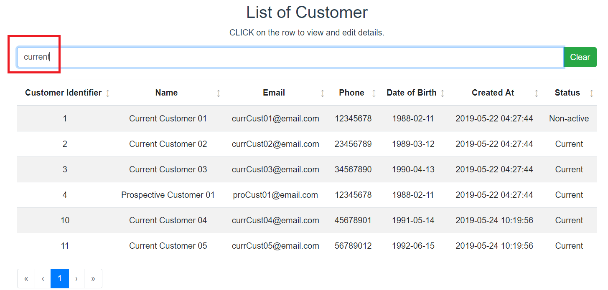
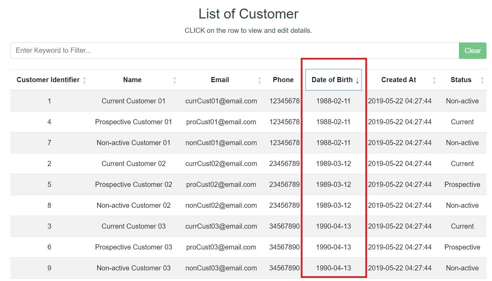
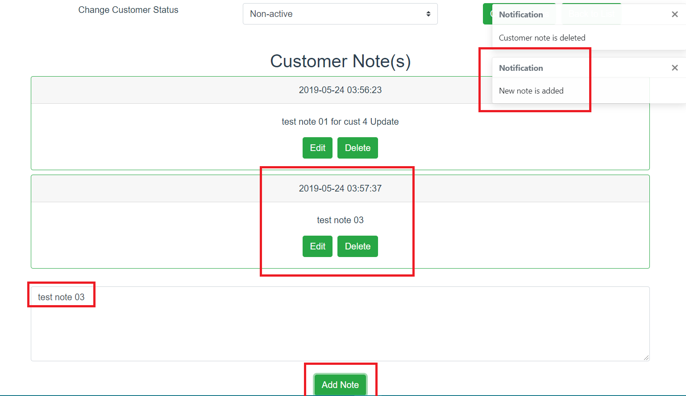
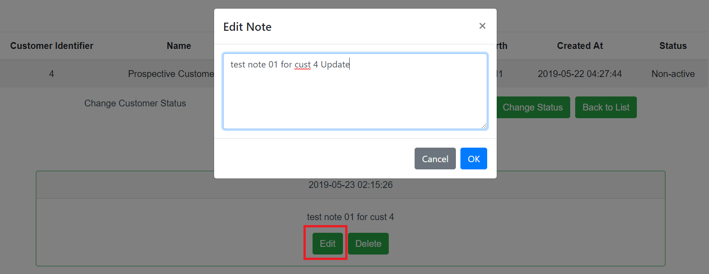
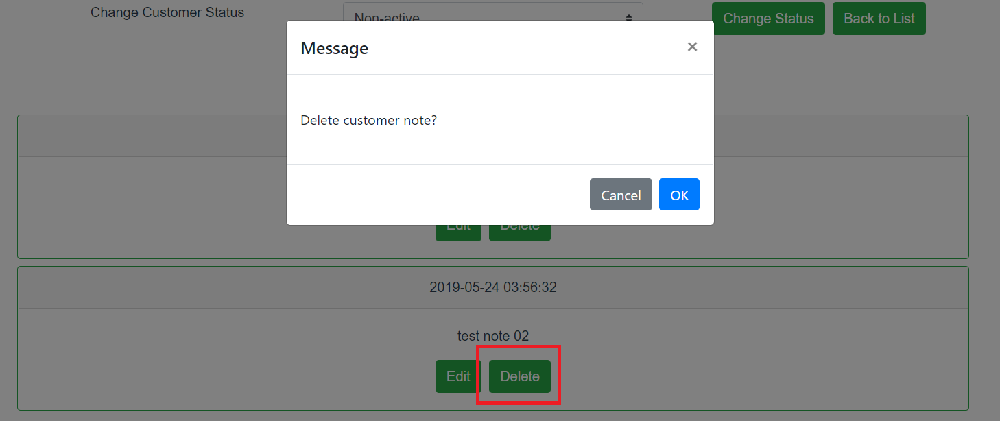
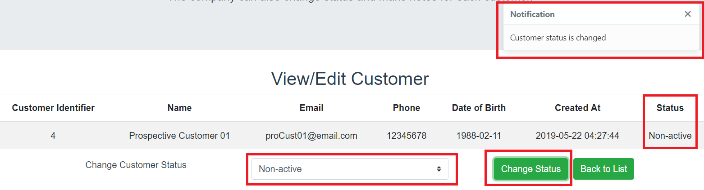

# CUSTOMER DEMO README

Author	: Au, Cheong Hang (auch007@gmail.com)

Date	: May 2019	

Try this demo on Google Cloud: http://34.87.94.30:8080/


## INTRODUCTION



This is a full-stack demo application showcasing a frontend built with Vue.js and a backend built with Spring Boot and a MySQL database.

In this classic 3-tier application architecture, the frontend is communicating to the backend with RESTful APIs and data persistence is achieved with use of JPA.

With a SPA frontend, some of the workload is shifted to the frontend to minimize data usage and to boost performance.

This illustrates an application that allows a company to see their customer information.

Customers have the following information associated with them:
- Unique customer identifier.
- Status: one of "prospective", "current" or "non-active".
- Creation date and time.
- General information like name and contact details.

The company can also make notes for each customer. A customer can have any number of notes associated with them.

The user is able to:
- Filter the list of customers.



- Sort the list of customers.




- Click on a customer in the list to view their details and add/edit notes for that customer.

- Confirm to edit


- Add new note



- Update note



- Delete note




- Change their status




## PROJECT SETUP

```
customer_demo
├─┬ backend      → backend module with Spring Boot code
│ ├── src
│ └── pom.xml
├─┬ frontend     → frontend module with Vue.js code
│ ├── src
├── init         → scripts to initialize the database
├── README.md    → this file
```

## PREREQUISITES FOR BUILD

The following packages are required for building the app:
- Maven
- Node.js and NPM
- Vue CLI
- Other node modules
	- bootstrap vue
	- axios
	- moment
- MySQL database (running as service)


## STEPS TO BUILD AND DEPLOY

### 1. Database Schema Initialization

	1.1 Execute the SQL statements to create the database schema
	
		/customer_demo/init/bootstrap.sql

	1.2 Execute the SQL statements to populate the database schmea with testing data
	
		/customer_demo/init/data_seed.sql


### 2. Application Configuration
	
	2.1 Configure the JDBC connection string in
	
		/customer_demo/backend/src/main/resources/application.properties
	
		For example,	
			## MySQL
			spring.datasource.url=jdbc:mysql://192.168.56.101:3306/company_db
			spring.datasource.username=dbuser
			spring.datasource.password=password

	2.2. You can change the build version at
		
		/customer_demo/backend/pom.xml
		
		<version>1.0.0</version>

			
### 3. Frontend App Build (Optional)
	
	3.1 Create a Vue project with the following features
		- Babel
		- Router
		- Vuex

	3.2 Incorporate the source code in folder "frontend" into the newly created Vue project

	3.3 Build the frontend app with NPM
			
			npm run build
			

	3.4 Copy the frontend build artifact in "dist" folder to backend "public" folder for integration between Vue.js and Spring Boot
			
			cp -R /customer_demo/frontend/dist /customer_demo/backend/src/main/resources/public
			
	NOTE This is an important step to combine the two frameworks together to work
				
	Due to the long build time for installing the node modules and such, if you want to skip this step, 
	the compiled JS code is already checked into the "public" folder of the backend source code. 
	You may skip this part entirely if you have not modified the frontend code.
			

### 4. Backend App Build
	
	4.1 Make sure the compiled frontend JS code is already copied to
	
		/customer_demo/backend/src/main/resources/public
	
	4.2 Compile, test and package the app with Maven
			
			mvn compile
			mvn package
			

	4.3 After a successful Maven build, the final artifact is located at 
	
		/customer_demo/backend/target/customer_demo_app-1.0.0.jar

		
### 5. Start up the server with
	
	java -jar customer_demo_app-1.0.0.jar | tee customer_demo_app.log
	

### 6. The web service will be available at HTTP port 8080.


## AREAS FOR IMPROVEMENT

Due to demo purpose a quick prototyping approach is used for developing this app. This app can only be considered minimally viable (or not!). The following areas can be further improved:

- Better UI/UX design (Responsive Web Design is already supported)
- SPA enhancements (router guard, more robust state management, PWA...etc)
- Better unit test cases design
- Swagger for RESTful APIs
- User authentication	(OAuth2, JWT...etc)
- Software hardening	(prevention for vulnerability, TLS support)
- Optimization for performance (balance between frontend/backend workload)
- Better client-side/server-side validations
- Better support for CI/CD
- Support for containerization
- Better logging and audit trails
- and many others